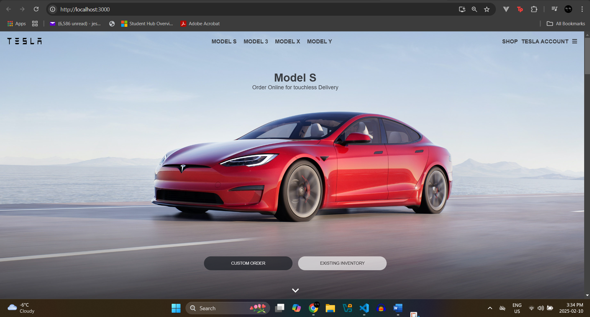

# 🚗 Tesla Clone

A **Tesla website clone** built using **React.js** and **Styled Components**. This project replicates Tesla's homepage with smooth animations and responsive design.

## 📌 Features
✅ Fully responsive design
✅ Smooth scrolling & animations
✅ Mobile-friendly navigation menu (burger menu)
✅ Styled with **Styled Components**
✅ Uses React Icons for UI elements

## 🛠️ Technologies Used
- **React.js** (Frontend framework)
- **Styled Components** (CSS-in-JS for styling)
- **React Icons** (For icons like menu, close, etc.)
- **React Reveal / Framer Motion** (For animations)

## 🚀 Live Demo
🔗 **[Live Project](https://tesla-clone-rijm.onrender.com)**


## 🖥️ Setup Instructions
Follow these steps to run the project locally:

### 1️⃣ Clone the Repository
```bash
git clone https://github.com/Jeshan26/tesla-clone.git
cd tesla-clone
```

### 2️⃣ Install Dependencies
```bash
npm install  # or yarn install
```

### 3️⃣ Start the Development Server
```bash
npm start  # or yarn start
```
Your app will run at **http://localhost:3000/**.

### 4️⃣ Build for Production
```bash
npm run build
```
This creates an optimized production-ready build in the `/build` folder.


## 📷 Screenshots


## 💡 Future Enhancements
🚀 Add dark mode
🚀 Improve animations using Framer Motion
🚀 Implement backend for authentication

## 📌 Author
👩‍💻 **Jeshan Chhabra**

📧 Contact: [jeshanchhabra@yahoo.com](mailto:your-email@example.com)

## ⭐ Star the Repository
If you liked this project, please ⭐ it on GitHub!
```bash
git add .
git commit -m "Added Tesla Clone README"
git push origin main
